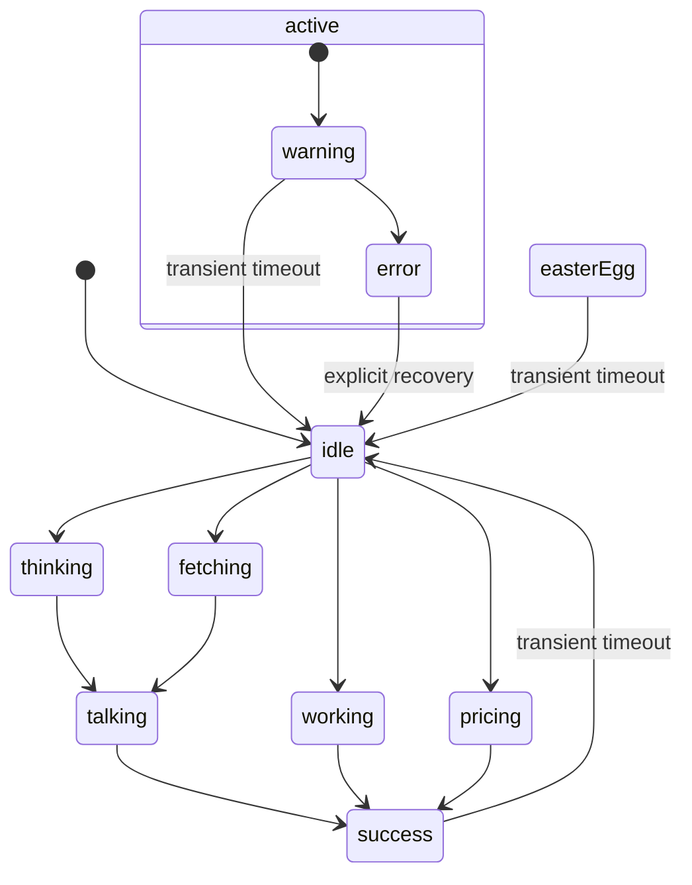

# Quant Bateman assistant

## Product philosophy

Quant Bateman is a persistent product-status and assistant surface. The global component remains compact on normal routes and opens a source-aware quick assistant. Ask replaces that floating instance with one prominent, embedded character stage so the approved artwork is part of the primary interaction rather than a corner decoration.

The default identity is always the approved dark pinstripe suit. Alternate outfits are explicit controls only. The laughing pose is the primary success state, and the business-card pose is an easter egg.

## Architecture

`AppShell` owns one `QuantBatemanProvider` and one `QuantBatemanAssistant`. Any routed module inside the shell can call `useQuantBateman()` without importing renderer or asset details.

```text
AppShell
└── QuantBatemanProvider
    ├── page modules → useQuantBateman()
    ├── QuantBatemanAssistant (all routes except Ask)
        ├── QuantBatemanCharacter
        │   ├── QuantBatemanImageRenderer
        │   └── QuantBatemanRiveRenderer (drop-in contract)
        ├── QuantBatemanBubble
        └── QuantBatemanMiniChat
    └── Ask → QuantBatemanAskStage
```

The state model is independent of PNG and future Rive rendering.



## State and asset map

The original 1024×1536 PNG files remain unchanged under `public/characters/quant-bateman/source`. The renderer uses 512×768 PNG derivatives under `web` to reduce global transfer and decode cost.

| State / control | Approved source | Web derivative | Visual role |
| --- | --- | --- | --- |
| `idle` | `source-06.png` / `09_51_58 PM (1)` | `idle-pinstripe.png` | Neutral dark pinstripe default |
| `thinking` | `source-05.png` / `09_51_58 PM (2)` | `thinking.png` | Hand-on-chin analysis |
| `fetching` | `source-01.png` / `09_51_59 PM (6)` | `fetching-phone.png` | Checking a data source |
| `working` | `source-04.png` / `09_51_59 PM (3)` | `working-tablet.png` | Tablet and stylus |
| `pricing` | `source-03.png` / `09_51_59 PM (4)` | `pricing-charts.png` | Tablet with quantitative charts |
| `talking` | `source-02.png` / `09_51_59 PM (5)` | `talking-confident.png` | Confident explanation |
| `success` | `source-10.png` / `09_51_22 PM (1)` | `success-laugh.png` | Laughing success response |
| `warning` | `source-05.png` | `thinking.png` | Skeptical review |
| `error` | `source-01.png` | `fetching-phone.png` | Stern source/data check |
| `businessCard` | `source-09.png` / `09_51_22 PM (2)` | `business-card.png` | Double-click easter egg only |
| `graySuit` | `source-08.png` / `09_51_23 PM (3)` | `gray-suit.png` | Manual alternate outfit only |
| `camelCoat` | `source-07.png` / `09_51_23 PM (4)` | `camel-coat.png` | Manual alternate outfit only |

Pose overrides outfit, and outfit overrides normal state artwork. This prevents normal success or loading events from randomly changing clothing.

## State timing and messages

Transient durations live in `quantBateman.config.ts`, not page modules:

- success: 3.2 seconds, then idle;
- warning: 4 seconds, then idle;
- business-card easter egg: 4.2 seconds, then idle and default pose;
- error remains until an explicit state change.

Messages are React text inside the status bubble or mini-chat. They never live in artwork. Production modules must only report actual events; generic simulation strings are limited to the development lab.

## Drag behavior

The character uses pointer events for mouse and touch. The drag loop writes an imperative `translate3d` inside `requestAnimationFrame`, so React does not render at pointer frequency. React state and local storage update once on drag end.

- A six-pixel threshold separates click from drag.
- The hitbox is the complete compact character region, not just opaque pixels.
- Position is clamped to configurable top/right/bottom/left safe margins.
- Stored coordinates use `tqb-quant-bateman-position-v1`.
- Resize revalidates stored coordinates.
- Edge snapping is disabled in configuration but the hook is structured so it can be added without changing consumers.
- `resetPosition()` clears storage and returns to the CSS bottom-right default.

## Ask integration

Ask uses `/api/assistant`, the existing evidence router, current AI provider selection, and returned source lineage. Its UI is conversation-first: prompt categories, distinct user/assistant turns, citations, copy, retry/depth actions, Enter submission, Shift+Enter line breaks, cancellation through `AbortController`, and responsive composition.

Ask renders `QuantBatemanAskStage` beside the prompt or conversation surface and suppresses the floating assistant on that route. The stage always starts with the dark pinstripe identity and exposes deliberate `READY`, `WORKFLOW`, and `PRICING` previews.

The two approved motion references define behavior rather than replacing the PNG set:

- workflow moves from phone (`fetching`) to tablet (`working`) to assumption review (`thinking`);
- pricing uses the chart-tablet pose plus restrained gold data planes, then the laughing success pose;
- state changes cross-fade approved PNGs; there is no continuous decorative idle motion.

## Application event integration

Integrations are intentional rather than global fetch interception:

- Ask request start → `fetching`;
- Ask request in progress → `working` or `pricing`, based on the question;
- Ask response → `talking`, then transient `success`;
- Ask failure → `error`;
- implied-volatility solve start → `pricing`;
- successful solve → `success`;
- invalid solve → `error`.

Other calculations can follow the same pattern:

```tsx
const qb = useQuantBateman();

qb.setState("pricing", "Computing Greeks...");
try {
  const result = priceVanilla(input);
  qb.success("Greeks computed.");
  return result;
} catch (error) {
  qb.error(error instanceof Error ? error.message : "Pricing failed.");
}
```

## Responsive, accessibility and performance

- Desktop: 152×228px floating character; Ask uses a dedicated stage with a roughly 330px-wide full-body presentation.
- Tablet/mobile: the Ask stage becomes a compact horizontal composition; the floating character reduces to 88×132px on other routes and its mini-chat becomes a constrained bottom sheet.
- The character is keyboard-openable, labelled, focus-visible, and independently nonessential to the chat.
- Images are decorative (`alt=""`); state and messages have text semantics.
- `prefers-reduced-motion` collapses all movement through the design system’s global reduction rule.
- Core derivatives preload in the provider; only idle is document-preloaded.
- No new animation or global canvas dependency was added.

## Extending the system

To add a state:

1. Add it to `QuantBatemanState`.
2. Add its label and optional transient duration in `quantBateman.config.ts`.
3. Add an approved asset entry and state mapping in `quantBateman.assets.ts`.
4. Add restrained state-specific CSS and a development-lab button.
5. Document the product event that is allowed to activate it.

To add an outfit:

1. Preserve the approved original under `source` and create a web derivative.
2. Extend `QuantBatemanOutfit` and the asset manifest.
3. Add an explicit control in the development lab or future user preference.
4. Never add the outfit to random or normal state transitions.

The development-only preview is available at `/dev/quant-bateman` in local development. Production builds show no controls.
